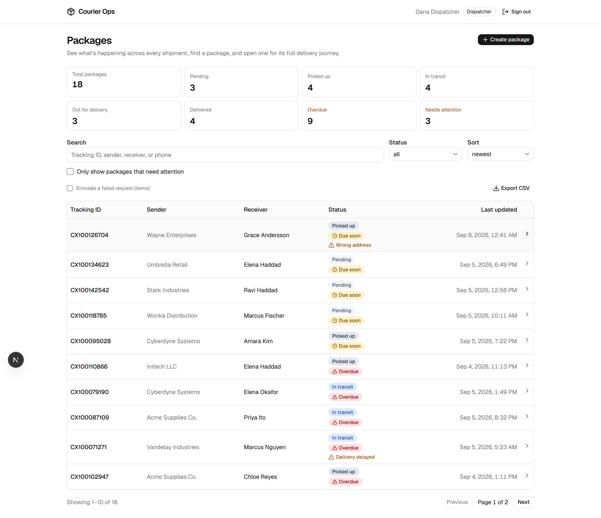
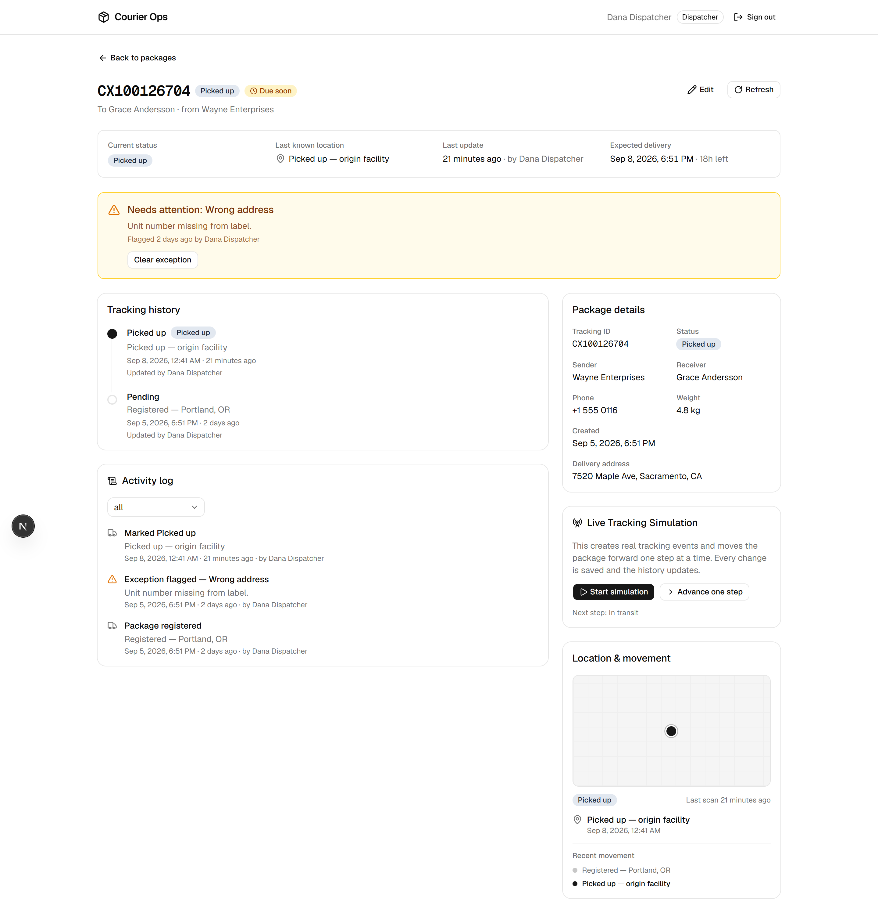
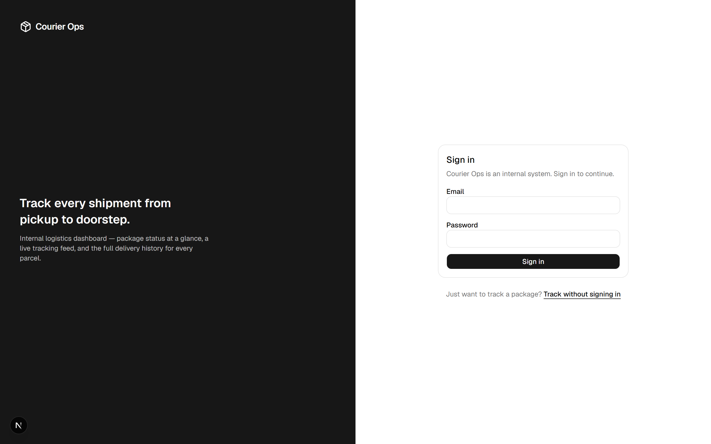
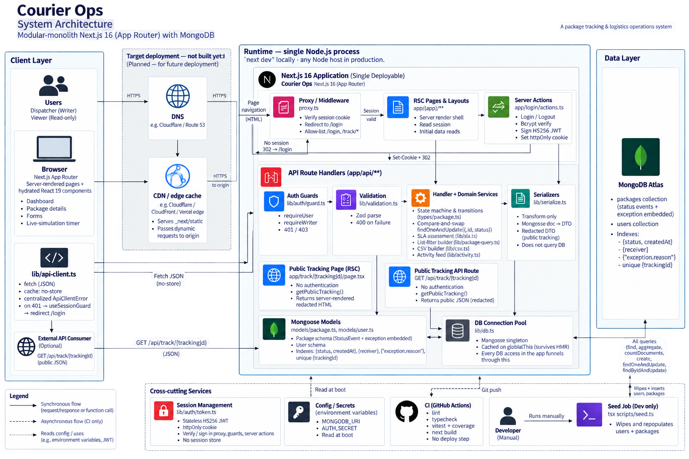

# Courier Ops Dashboard

An internal operations tool for a parcel‑delivery company. Dispatchers register
packages, push tracking scans as a shipment moves through the network, and flag
the ones that need attention; viewers get read‑only visibility into every
shipment. Built as a full‑stack **Next.js 16 (App Router) + MongoDB** app with
its own session auth, role‑based access control, and a forward‑only shipment
state machine enforced on the server.

<!--
  Screenshots make this page. Drop three images in docs/ and uncomment:

  
  
  
-->

---

## Highlights

- **Custom session auth, no library.** Stateless JWT sessions (`jose`, HS256) in
  an `httpOnly` cookie, `bcrypt` password hashing, and a **constant‑time login
  path** — an invalid email still runs a bcrypt compare so response timing can't
  be used to enumerate accounts.
- **Role‑based access control.** Two roles (`dispatcher` / `viewer`). Every
  mutating route is guarded by `requireWriter()`; the UI hides actions a viewer
  can't take, and the API rejects them anyway (`403`) so the client is never
  trusted.
- **Server‑authoritative state machine.** A package moves `Pending → Picked up →
In transit → Out for delivery → Delivered`, one step at a time, never
  backwards. Transitions are validated server‑side and applied as a
  **compare‑and‑swap** on the current status, so two concurrent updates can't
  skip or double‑advance a step.
- **Live Tracking Simulation.** A panel on the detail page fires real
  `PATCH /status` requests on a 5–8 s self‑rescheduling timer — Mongo is
  genuinely updated and the page re‑fetches. It's a demo of the pipeline, not a
  UI animation.
- **Delivery SLA tracking.** Every package has a derived deadline
  (`createdAt` + 72 h). The list, detail page and an **Overdue** dashboard tile
  surface `on‑track` / `due‑soon` / `overdue` / `delivered‑late` from one
  pure, unit‑tested `assessSla()` — no stored field, so it works for historical
  data too.
- **Public tracking page.** `/track` is reachable without a session (allow‑listed
  in `proxy.ts`) and serves a **redacted DTO** — status and scan history only,
  no sender/receiver/address/actor. A dedicated `serializePublicTracking()` is
  the single place that redaction happens.
- **Edit before pickup.** Shipment details are editable only while `Pending` or
  `Picked up`; the API returns `409` once the package is in transit, and the UI
  hides the button. `PATCH /api/packages/[id]` with a partial body; `null` clears
  the phone.
- **CSV export.** `GET /api/packages/export` streams the _current filter set_
  (shared `buildPackageFilter()` with the list endpoint) as a downloadable CSV,
  through a minimal RFC‑4180 serializer.
- **Activity log.** The detail page merges status history and the exception flag
  into one filterable, chronological audit view (who did what, when).
- **Validation everywhere.** Every request body and query string is parsed with
  **Zod**; field errors come back as `{ error, details: { field: [msg] } }` and
  render inline on the form. The list endpoint's query schema is deliberately
  lenient — bad params fall back to sane defaults instead of 400‑ing the whole
  page.
- **Considered data modelling.** Status events are **embedded** on the package
  document (bounded, always read together, atomic `$push` + `$set`) rather than
  a separate collection. Indexes are built around the actual query patterns, not
  sprinkled on hopefully.
- **Honest loading & error states.** Skeletons, empty states, retry buttons, and
  request cancellation via `AbortController`. Hidden `?fail=true` / `?delay=<ms>`
  hooks on the read endpoints let you demo those states on command.
- **Reproducible seed data.** `npm run seed` wipes and rebuilds a realistic
  spread of 18 packages across every status — with full timelines and a few
  exceptions — from a **seeded PRNG** (`mulberry32`), so the demo looks the same
  every run.

---

## Tech stack

| Area       | Choices                                                                       |
| ---------- | ----------------------------------------------------------------------------- |
| Framework  | Next.js 16.3 (App Router, Server Components, Server Actions), React 19        |
| Language   | TypeScript (strict)                                                           |
| Database   | MongoDB Atlas + Mongoose 8                                                    |
| Auth       | `jose` (JWT), `bcryptjs`, `httpOnly` cookie sessions, proxy‑level route guard |
| Validation | Zod (request bodies, query strings, server actions)                           |
| UI         | Tailwind CSS v4, shadcn/ui + Base UI primitives, `lucide-react`, light/dark   |
| Testing    | Vitest (unit + V8 coverage), 85 tests over the domain logic                   |
| CI         | GitHub Actions — lint · typecheck · test · build on every push and PR         |
| Tooling    | ESLint 9, Prettier, `tsx` for the seed script                                 |

---

## Architecture



---

## Data model

**Package** (`models/package.ts`)

| Field                                                        | Notes                                                        |
| ------------------------------------------------------------ | ------------------------------------------------------------ |
| `trackingId`                                                 | `CX` + 9 digits, unique, server‑assigned                     |
| `sender` / `receiver` / `receiverAddress` / `receiverPhone?` | contact + destination                                        |
| `weight`                                                     | kilograms                                                    |
| `status`                                                     | one of the 6 statuses; current position in the flow          |
| `exception`                                                  | `{ reason, note?, flaggedAt, flaggedBy }` or `null`          |
| `events[]`                                                   | embedded `StatusEvent` sub‑docs — the full tracking timeline |
| `createdAt` / `updatedAt`                                    | timestamps (also drive the derived delivery SLA)             |

Indexes: `{ status, createdAt }` (list + sort, also the overdue filter),
`{ receiver }` (search), `{ "exception.reason" }` (needs‑attention filter), plus
the unique `trackingId`.

**User** (`models/user.ts`) — `email` (unique), `name`, `passwordHash` (never
serialized), `role`.

---

## API

Every route needs a valid session **except** `GET /api/track/[trackingId]`,
which is public. Writes require the `dispatcher` role.

| Method & path                        | Role       | Purpose                                                                          |
| ------------------------------------ | ---------- | -------------------------------------------------------------------------------- |
| `GET /api/packages`                  | any        | List with `search`, `status`, `exception`, `overdue`, `page`, `pageSize`, `sort` |
| `POST /api/packages`                 | dispatcher | Create a package; server assigns the tracking ID + opening event                 |
| `GET /api/packages/export`           | any        | Current filtered list as a CSV download (no pagination, capped at 5 000 rows)    |
| `GET /api/packages/summary`          | any        | Dashboard counts (aggregation): total, by status, exceptions, overdue            |
| `GET /api/packages/[id]`             | any        | One package + full history; `id` is an ObjectId **or** a tracking ID             |
| `PATCH /api/packages/[id]`           | dispatcher | Edit shipment details (only while `Pending` / `Picked up`, else `409`)           |
| `PATCH /api/packages/[id]/status`    | dispatcher | Append a scan and advance the status (validated transition, CAS)                 |
| `PATCH /api/packages/[id]/exception` | dispatcher | Flag a package as needing attention, or clear it (`reason: null`)                |
| `GET /api/track/[trackingId]`        | **public** | Redacted tracking view — status + scan history only                              |

Read endpoints also accept `?fail=true` and `?delay=<ms>` (capped at 10 s) to
exercise the error and loading states.

### Pages

| Route                 | Access     | Purpose                                          |
| --------------------- | ---------- | ------------------------------------------------ |
| `/`                   | any        | Dashboard — list, filters, summary tiles         |
| `/package/new`        | dispatcher | Create a package                                 |
| `/package/[id]`       | any        | Detail — timeline, activity log, SLA, simulation |
| `/package/[id]/edit`  | dispatcher | Edit shipment details before pickup              |
| `/track`              | **public** | Enter a tracking number                          |
| `/track/[trackingId]` | **public** | Customer‑facing status + history                 |
| `/login`              | **public** | Sign in (links through to `/track`)              |

---

## Getting started

### Prerequisites

- **Node.js 20+**
- A **MongoDB** connection string (a free MongoDB Atlas cluster works)

### 1. Install

```bash
npm install
```

### 2. Configure environment

```bash
cp .env.example .env.local
```

Fill in `.env.local`:

| Variable                   | Required | Description                                                                                                                          |
| -------------------------- | -------- | ------------------------------------------------------------------------------------------------------------------------------------ |
| `MONGODB_URI`              | yes      | MongoDB connection string, including the database name                                                                               |
| `AUTH_SECRET`              | yes      | Secret for signing session JWTs. Generate one with:<br>`node -e "console.log(require('crypto').randomBytes(33).toString('base64'))"` |
| `NEXT_PUBLIC_API_BASE_URL` | no       | Absolute API base; leave blank to call the same origin                                                                               |

### 3. Seed the database

```bash
npm run seed
```

Wipes `users` and `packages`, then inserts the demo accounts and 18 packages
with full timelines. Safe to re‑run.

### 4. Run

```bash
npm run dev
```

Open <http://localhost:3000>.

### Demo accounts

| Role       | Email                    | Password      | Can do                                               |
| ---------- | ------------------------ | ------------- | ---------------------------------------------------- |
| Dispatcher | `dispatcher@courier.dev` | `dispatch123` | Everything — create, advance status, flag exceptions |
| Viewer     | `viewer@courier.dev`     | `viewer123`   | Read‑only                                            |

---

## Scripts

| Command                 | What it does                              |
| ----------------------- | ----------------------------------------- |
| `npm run dev`           | Start the dev server                      |
| `npm run build`         | Production build                          |
| `npm run start`         | Serve the production build                |
| `npm run seed`          | Reset + reseed the database               |
| `npm test`              | Run the unit tests in watch mode          |
| `npm run test:run`      | Run the unit tests once                   |
| `npm run test:coverage` | Run the unit tests with a coverage report |
| `npm run typecheck`     | `tsc --noEmit`                            |
| `npm run lint`          | ESLint                                    |
| `npm run format`        | Prettier write                            |

---

## Testing

Unit tests run with **Vitest** in the Node environment and cover the pure domain
logic — the parts where a bug is a real bug, not a re-render:

- **The status state machine** (`types/package.ts`) — every legal forward step,
  and that backwards moves, skips, no-ops, and post-`Delivered` moves are all
  rejected.
- **Validation** (`lib/validation.ts`) — each Zod schema's accept/reject cases,
  and the lenient list-query fallbacks.
- **Serialization** (`lib/serialize.ts`) — `_id → id`, `Date → ISO`, timeline
  ordering, `updatedBy` mapping, and that the input isn't mutated.
- **Auth primitives** — session-token sign/verify round-trip, tampered/expired/
  wrong-secret tokens, bcrypt hash + verify, role checks.
- **Delivery SLA** (`lib/sla.ts`) — on-track / at-risk / breached / met / missed
  across the deadline, in flight and delivered.
- **CSV** (`lib/csv.ts`) — RFC-4180 quoting, embedded quotes/commas/newlines.
- **Activity feed** (`lib/activity.ts`) — status history + exception merged in
  chronological order.
- **Public redaction** (`lib/serialize.ts`) — asserts the public DTO leaks no
  sender / receiver / address / phone / actor.
- **Helpers** — tracking-ID shape, regex escaping, relative-time formatting,
  simulated scan locations, the demo `?fail` / `?delay` hooks.

```bash
npm run test:coverage
```

Coverage thresholds (90% lines / statements / functions, 85% branches) are
enforced against these modules in CI. Infrastructure-bound code (`db.ts`, the
`next/headers` guards, the browser API client) is intentionally left to the
integration and E2E layers rather than held to a unit-coverage bar.

## Continuous integration

[`.github/workflows/ci.yml`](.github/workflows/ci.yml) runs on every push and
pull request to `main`: **install → lint → typecheck → test + coverage →
production build**. The coverage report is uploaded as a build artifact.

---

## Project structure

```
app/
  (app)/            authenticated area — list, detail, create, edit
  api/packages/     route handlers (list, create, export, summary, detail, edit, status, exception)
  api/track/        public tracking endpoint
  track/            public tracking pages
  login/            login page + server actions
components/
  packages/         list, table, toolbar, timeline, activity log, sla badge, detail, forms
  tracking/         public tracking lookup form
  ui/               shadcn/ui primitives
  auth/             login form, user badge
hooks/              usePackages, usePackage, usePackageStats, useLiveSimulation, useSessionGuard
lib/
  auth/             token (sign/verify), session (cookie), guard (route), password (bcrypt)
  db.ts             singleton Mongoose connection
  api-client.ts     the one place the frontend calls the backend
  serialize.ts      Mongoose docs → JSON DTOs (incl. the redacted public view)
  validation.ts     Zod schemas
  sla.ts            derived delivery-SLA assessment
  package-query.ts  shared MongoDB filter builder (list + export)
  activity.ts       status history + exception → one activity feed
  csv.ts            RFC-4180 serializer
  *.test.ts         colocated Vitest unit tests
models/             Package, StatusEvent (embedded), User
types/              shared domain types + the status-transition table
scripts/seed.ts     reproducible demo data
proxy.ts            page-level auth redirect (Next 16's middleware)
.github/workflows/  CI pipeline
```

---

## Possible next steps

- Integration tests for the route handlers (`mongodb-memory-server`) — the
  `403` for a viewer write, the rejected backwards transition, the CAS conflict,
  the edit‑after‑pickup `409`, the public‑DTO redaction
- E2E tests (Playwright) over the dispatcher, viewer and public‑tracking flows
- Persist an audit trail (cleared exceptions, edit diffs) instead of deriving
  the activity log from current state
- Per‑lane SLA targets instead of a single 72 h transit budget
- Optimistic UI on status advance instead of re‑fetch
- Real map tiles + geocoding behind the current stylised location view
